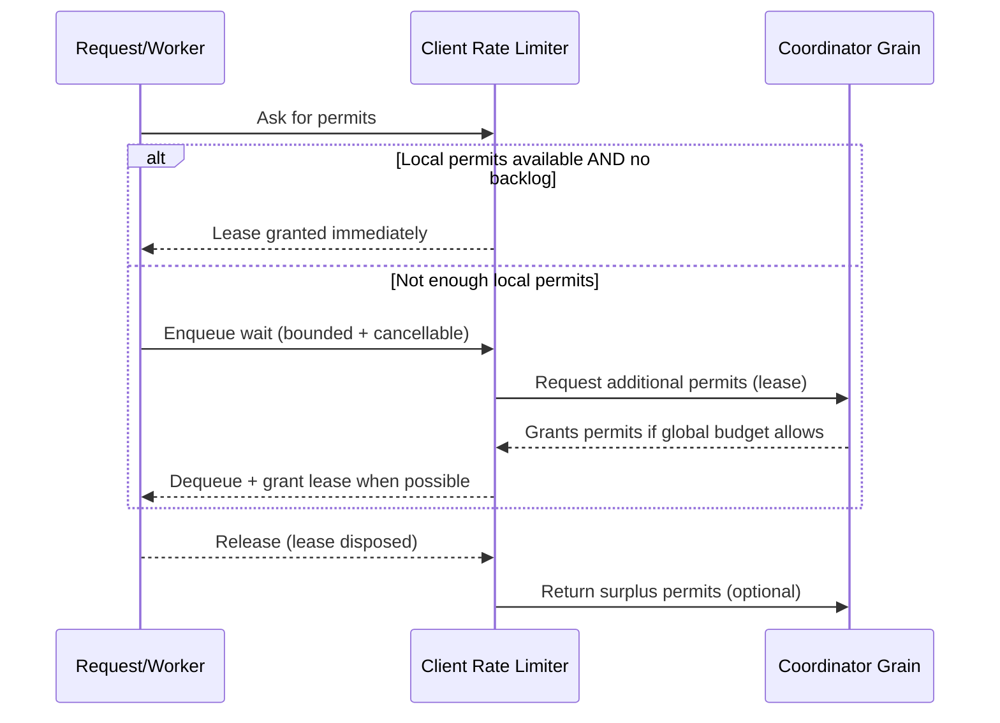

# Distributed Rate Limiting (Orleans + .NET)

A distributed, fault-tolerant rate limiter built on **Microsoft Orleans** that enforces a **single global permit budget** across many clients/instances. It is designed for backend services where you need consistent throttling across a scaled-out fleet (not “per-node” limits).

This repo contains:
- **`DistributedRateLimiting.Orleans/`**: the rate limiter library (client-side limiter + coordinator Grain)
- **`TestApp/`**: a small console harness to run a local Orleans cluster and generate concurrent load

---

## Architecture

### High-level components

- **Client-side Rate Limiter (per process/service instance)**
  - Maintains a *local* pool of permits for fast path decisions
  - Queues requests when permits are not available
  - Runs a background loop that **leases permits from the coordinator** and returns unused permits

- **Coordinator Grain (cluster-wide)**
  - Owns the **global permit pool**
  - Tracks client state (in-use permits, last seen, idempotency sequence)
  - Purges idle clients to reclaim permits
  - Notifies clients when capacity becomes available

### Diagram (Mermaid)

> GitHub renders Mermaid diagrams automatically in Markdown.

```mermaid
flowchart LR
  subgraph Client["Service Instance / Client Process"]
    W[Workers / Requests] --> L[Distributed Rate Limiter]
    L --> Q[Bounded Wait Queue\n(cancellation-aware)]
    L --> LP[Local Permit Cache]
    L --> BG[Background Lease Loop]
    BG -->|Try acquire / Release| O[(Orleans Runtime)]
  end

  subgraph Cluster["Orleans Cluster"]
    O --> C[Coordinator Grain]
    C --> GP[(Global Permit Pool)]
    C --> CS[(Client State Map)]
    C --> PR[(Pending Request Queue)]
    C --> T[Timers:\nIdle purge + lease refresh]
  end

  C -->|Notify permits available| L
  L -->|Dispose lease returns permits| BG
```

### Request flow (sequence)



---

## Key behaviors (what this project guarantees)

- **Global throttling across clients**
  - A single **global permit count** is enforced cluster-wide (not per instance).

- **Safe overload handling**
  - Requests that can’t be served immediately are placed into a **bounded queue**.
  - When the queue capacity is exceeded, the request fails fast instead of growing without bound.

- **Cancellation support**
  - Waiting requests can be cancelled cleanly, and the queue accounting remains consistent.

- **Retry safety / idempotency**
  - The coordinator uses a **monotonic sequence number** per client so retries don’t double-apply state.

- **Permit leak protection**
  - Idle clients are dropped after a timeout and their in-use permits are reclaimed.

---

## Configuration

`DistributedRateLimiterOptions`:

| Option | Meaning |
|---|---|
| `GlobalPermitCount` | Max permits available across all clients combined |
| `TargetPermitsPerClient` | Client tries to maintain this many leased permits locally |
| `QueueLimit` | Upper bound for queued (waiting) permits |
| `IdleClientTimeout` | Drop idle clients and reclaim their in-use permits |
| `ClientLeaseRefreshInterval` | Periodic client refresh to stay “alive” |

The demo app configures:
- `GlobalPermitCount = 100`
- `TargetPermitsPerClient = 20`
- `QueueLimit = 200`

---

## Local Quickstart

### Prerequisites
- .NET SDK **7.x**
- Windows/macOS/Linux
- (Optional) Visual Studio / Rider / VS Code

### Run the demo
From the repo root:

```bash
dotnet restore
dotnet run --project TestApp
```

The `TestApp` starts:
- a local Orleans silo (localhost clustering)
- a rate limiter instance wired through DI
- multiple worker tasks that repeatedly request permits, hold them briefly, and release

### Run multiple silo instances (local cluster)
You can start additional instances by passing an integer argument.

Terminal 1:
```bash
dotnet run --project TestApp -- 0
```

Terminal 2:
```bash
dotnet run --project TestApp -- 1
```

Terminal 3:
```bash
dotnet run --project TestApp -- 2
```

Each instance joins the same localhost cluster and competes for the same global permit budget.

---

## Repository layout

```
.
├── DistributedRateLimiting.Orleans/
│   ├── DistributedRateLimiter.cs
│   ├── DistributedRateLimiterCoordinator.cs
│   ├── DistributedRateLimiterOptions.cs
│   ├── IDistributedRateLimiterCoordinator.cs
│   ├── IRateLimiterClient.cs
│   └── ServiceCollectionExtensions.cs
└── TestApp/
    └── Program.cs
```

---

## Design notes (for reviewers)

### Why a local permit cache?
Client-side caching reduces coordinator calls and keeps the “fast path” cheap when permits are already available locally.

### Why a bounded queue?
Backpressure prevents a thundering herd from creating unbounded memory growth and cascading failures during burst traffic.

### Why idle-client purge?
In real systems, processes crash. Purging idle clients helps reclaim permits that would otherwise remain “in-use” forever.

### Why sequence numbers?
Distributed calls can fail and be retried. Sequence numbers make acquire/release **idempotent** and safe to retry.

---

## Observability (recommended additions)

The library already logs unexpected exceptions from the background loop. For production-grade usage, consider adding:

### Telemetry (metrics + traces)
Track:
- allowed vs throttled decisions
- queue depth and wait time
- coordinator call latency
- permits available / in-use
- error counts

### Health checks (liveness + readiness)
Expose:
- **Liveness**: process is running
- **Readiness**: coordinator is reachable and the limiter is able to make progress

> If you add telemetry + health checks, this becomes a strong “live service operations” story for backend/cloud roles.

---

## Roadmap ideas (small, high-value)
- Add a minimal **ASP.NET** sample to gate an HTTP endpoint behind the limiter
- Add **OpenTelemetry** metrics/tracing
- Add **HealthChecks** endpoints for readiness/liveness
- Add load tests and publish p95/p99 latency numbers
- Add CI (GitHub Actions): build + test + lint

---

## License
Add a `LICENSE` file if you plan to make this public/open-source.

---

## Resume-ready one-liner
“Distributed rate limiter on Orleans enforcing a shared global permit budget across scaled clients with bounded backpressure, retry-safe coordination, and idle-client reclamation for reliability.”
