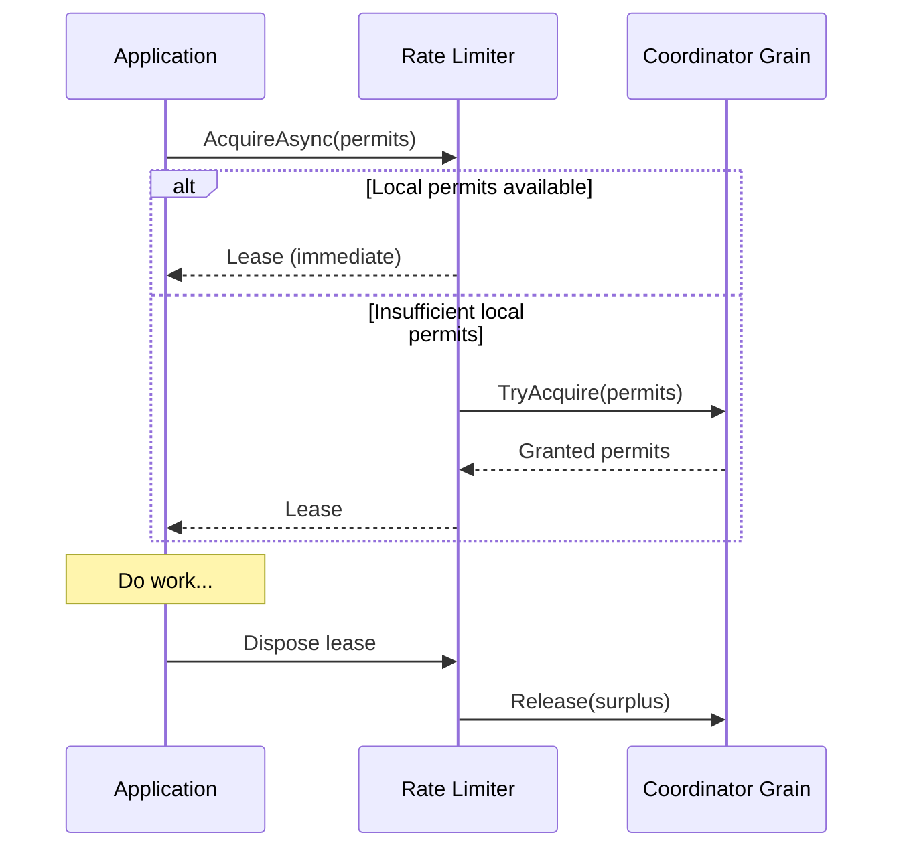

<div align="center">

# Distributed Rate Limiter

### A production-grade, fault-tolerant rate limiting solution built on Microsoft Orleans

[](https://github.com/YOUR_USERNAME/distributed-rate-limiter/actions/workflows/build.yml)
[](https://www.nuget.org/packages/DistributedRateLimiting.Orleans)
[](https://opensource.org/licenses/MIT)
[](https://dotnet.microsoft.com/download/dotnet/8.0)
[](https://dotnet.github.io/orleans/)

[Features](#features) |
[Quick Start](#quick-start) |
[Configuration](#configuration) |
[Architecture](#architecture) |
[API Reference](#api-reference) |
[Contributing](#contributing)

</div>

---

## Overview

**Distributed Rate Limiter** is an enterprise-grade rate limiting library that enforces a **single global permit budget** across multiple service instances in a distributed system. Built on [Microsoft Orleans](https://dotnet.github.io/orleans/), it provides consistent throttling across your entire service fleet—not just per-node limits.

### Why Use This?

Traditional rate limiters operate per-instance, meaning if you have 10 instances with a 100 req/s limit each, your actual limit is 1000 req/s. This library ensures your **global limit stays at 100 req/s** regardless of how many instances you scale to.

---

## Features

| Feature | Description |
|---------|-------------|
| **Global Rate Limiting** | Single permit pool enforced across all service instances cluster-wide |
| **High Performance** | Local permit caching for fast-path decisions with minimal coordinator calls |
| **Fault Tolerant** | Built on Orleans virtual actor model with automatic failover |
| **Backpressure Support** | Bounded queue prevents unbounded memory growth during traffic spikes |
| **Cancellation Support** | Clean cancellation of waiting requests with consistent queue accounting |
| **Idempotent Operations** | Sequence number-based retry safety for distributed calls |
| **Automatic Cleanup** | Idle client purging reclaims permits from crashed processes |
| **NuGet Package** | Easy installation via NuGet package manager |

---

## Quick Start

### Installation

```bash
dotnet add package DistributedRateLimiting.Orleans
```

### Basic Usage

```csharp
using DistributedRateLimiting.Orleans;
using Microsoft.Extensions.DependencyInjection;
using Microsoft.Extensions.Hosting;
using System.Threading.RateLimiting;

var builder = Host.CreateApplicationBuilder(args);

// Configure Orleans
builder.UseOrleans(silo =>
{
    silo.UseLocalhostClustering();
});

// Add the distributed rate limiter
builder.Services.AddDistributedRateLimiter(options =>
{
    options.GlobalPermitCount = 100;      // Max 100 concurrent permits globally
    options.TargetPermitsPerClient = 20;  // Each client caches ~20 permits locally
    options.QueueLimit = 200;             // Max 200 requests can wait in queue
});

var host = builder.Build();
await host.StartAsync();

// Use the rate limiter
var rateLimiter = host.Services.GetRequiredService<RateLimiter>();

// Synchronous attempt (non-blocking)
using var lease = rateLimiter.AttemptAcquire(permitCount: 1);
if (lease.IsAcquired)
{
    // Permit acquired - do work
}

// Asynchronous wait (blocking until available)
using var asyncLease = await rateLimiter.AcquireAsync(permitCount: 5);
if (asyncLease.IsAcquired)
{
    // Permits acquired - do work
}
```

### ASP.NET Core Integration

```csharp
var builder = WebApplication.CreateBuilder(args);

builder.Host.UseOrleans(silo =>
{
    silo.UseLocalhostClustering();
});

builder.Services.AddDistributedRateLimiter(options =>
{
    options.GlobalPermitCount = 1000;
    options.TargetPermitsPerClient = 100;
    options.QueueLimit = 500;
});

var app = builder.Build();

app.MapGet("/api/resource", async (RateLimiter rateLimiter) =>
{
    using var lease = await rateLimiter.AcquireAsync(1);
    
    if (!lease.IsAcquired)
    {
        return Results.StatusCode(429); // Too Many Requests
    }
    
    return Results.Ok("Success!");
});

app.Run();
```

---

## Configuration

### DistributedRateLimiterOptions

| Option | Type | Default | Description |
|--------|------|---------|-------------|
| `GlobalPermitCount` | `int` | *Required* | Maximum permits available across all clients combined |
| `TargetPermitsPerClient` | `int` | *Required* | Number of permits each client tries to maintain locally |
| `QueueLimit` | `int` | *Required* | Upper bound for queued (waiting) permits |
| `IdleClientTimeout` | `TimeSpan` | 1 minute | Duration after which idle clients are dropped and permits reclaimed |
| `ClientLeaseRefreshInterval` | `TimeSpan` | 30 seconds | Interval at which clients refresh their lease with the coordinator |

### Configuration Guidelines

```csharp
services.AddDistributedRateLimiter(options =>
{
    // For a system with ~10 expected clients
    options.GlobalPermitCount = 100;
    options.TargetPermitsPerClient = 10;  // ~GlobalPermitCount / ExpectedClients
    
    // Backpressure: allow 2x the global limit to queue
    options.QueueLimit = 200;
    
    // Idle detection
    options.IdleClientTimeout = TimeSpan.FromMinutes(2);
    options.ClientLeaseRefreshInterval = TimeSpan.FromSeconds(30);
});
```

> **Important**: `ClientLeaseRefreshInterval` must be less than `IdleClientTimeout` to prevent active clients from being incorrectly purged.

---

## Architecture

### High-Level Components

```
+-------------------------------------------------------------------------+
|                        Orleans Cluster                                   |
|  +--------------------------------------------------------------------+ |
|  |                   Coordinator Grain                                 | |
|  |  +--------------+  +--------------+  +--------------------------+  | |
|  |  | Global Pool  |  | Client State |  |  Pending Request Queue   |  | |
|  |  |  (permits)   |  |    (map)     |  |                          |  | |
|  |  +--------------+  +--------------+  +--------------------------+  | |
|  +--------------------------------------------------------------------+ |
|          ^                    ^                       ^                  |
|          | TryAcquire         | Release               | Notify           |
|          | Release            | RefreshLeases         |                  |
+----------+--------------------+-----------------------+------------------+
           |                    |                       |
    +------+------+      +------+------+        +------+------+
    |  Service A  |      |  Service B  |        |  Service C  |
    | +---------+ |      | +---------+ |        | +---------+ |
    | | Local   | |      | | Local   | |        | | Local   | |
    | | Cache   | |      | | Cache   | |        | | Cache   | |
    | +---------+ |      | +---------+ |        | +---------+ |
    | +---------+ |      | +---------+ |        | +---------+ |
    | |  Queue  | |      | |  Queue  | |        | |  Queue  | |
    | +---------+ |      | +---------+ |        | +---------+ |
    +-------------+      +-------------+        +-------------+
```

### Component Responsibilities

| Component | Responsibility |
|-----------|----------------|
| **Client-side Rate Limiter** | Maintains local permit cache, queues requests, runs background lease loop |
| **Coordinator Grain** | Owns global permit pool, tracks client state, purges idle clients, notifies clients |
| **Local Permit Cache** | Enables fast-path decisions without coordinator round-trips |
| **Bounded Queue** | Provides backpressure during traffic spikes |

### Request Flow (Mermaid)



---

## API Reference

### DistributedRateLimiter

Inherits from `System.Threading.RateLimiting.RateLimiter`.

#### Methods

| Method | Description |
|--------|-------------|
| `AttemptAcquire(int permitCount)` | Attempts to acquire permits synchronously. Returns immediately. |
| `AcquireAsync(int permitCount, CancellationToken ct)` | Acquires permits asynchronously, waiting if necessary. |
| `GetAvailablePermits()` | Returns the number of permits available locally. |

#### Properties

| Property | Description |
|----------|-------------|
| `IdleDuration` | Time since the last successful lease operation. |

### RateLimitLease

Represents acquired permits. **Must be disposed** to release permits.

```csharp
using var lease = await rateLimiter.AcquireAsync(5);

if (lease.IsAcquired)
{
    // Do work with acquired permits
}
else if (lease.TryGetMetadata(MetadataName.ReasonPhrase, out var reason))
{
    Console.WriteLine($"Failed: {reason}");
}
// Permits automatically released when lease is disposed
```

---

## Testing

### Run All Tests

```bash
dotnet test
```

### Run Unit Tests Only

```bash
dotnet test tests/DistributedRateLimiting.Orleans.Tests
```

### Run Integration Tests Only

```bash
dotnet test tests/DistributedRateLimiting.Orleans.IntegrationTests
```

### Run with Coverage

```bash
dotnet test --collect:"XPlat Code Coverage"
```

---

## Running the Demo

### Prerequisites

- [.NET SDK 8.0](https://dotnet.microsoft.com/download/dotnet/8.0) or later
- Windows, macOS, or Linux

### Single Instance

```bash
dotnet run --project TestApp
```

### Multi-Instance Cluster (Local)

Open multiple terminals and run:

**Terminal 1:**
```bash
dotnet run --project TestApp -- 0
```

**Terminal 2:**
```bash
dotnet run --project TestApp -- 1
```

**Terminal 3:**
```bash
dotnet run --project TestApp -- 2
```

Each instance joins the same localhost cluster and competes for the same global permit budget.

---

## Project Structure

```
distributed-rate-limiter/
├── DistributedRateLimiting.Orleans/        # Core library
│   ├── DistributedRateLimiter.cs           # Client-side rate limiter
│   ├── DistributedRateLimiterCoordinator.cs # Orleans grain coordinator
│   ├── DistributedRateLimiterOptions.cs    # Configuration options
│   ├── IDistributedRateLimiterCoordinator.cs
│   ├── IRateLimiterClient.cs
│   └── ServiceCollectionExtensions.cs      # DI registration
├── TestApp/                                # Demo console application
│   └── Program.cs
├── tests/
│   ├── DistributedRateLimiting.Orleans.Tests/           # Unit tests
│   └── DistributedRateLimiting.Orleans.IntegrationTests/ # Integration tests
├── .github/workflows/                      # CI/CD pipelines
├── Directory.Build.props                   # Shared build configuration
├── .editorconfig                           # Code style settings
├── LICENSE                                 # MIT License
└── README.md
```

---

## Design Decisions

### Why Local Permit Caching?

Client-side caching reduces coordinator calls and keeps the "fast path" cheap when permits are already available locally. This dramatically improves performance under normal load.

### Why a Bounded Queue?

Backpressure prevents a thundering herd from creating unbounded memory growth and cascading failures during burst traffic. When the queue is full, requests fail fast with a clear reason.

### Why Idle-Client Purging?

In production systems, processes crash. Purging idle clients helps reclaim permits that would otherwise remain "in-use" forever, preventing permit leaks.

### Why Sequence Numbers?

Distributed calls can fail and be retried. Sequence numbers make acquire/release operations **idempotent** and safe to retry without double-applying state changes.

---

## Production Considerations

### Clustering Configuration

For production, replace localhost clustering with a persistent membership provider:

```csharp
// Azure Table Storage
silo.UseAzureStorageClustering(options =>
{
    options.ConfigureTableServiceClient(connectionString);
});

// Redis
silo.UseRedisClustering(options =>
{
    options.ConnectionString = redisConnectionString;
});

// SQL Server
silo.UseAdoNetClustering(options =>
{
    options.ConnectionString = sqlConnectionString;
    options.Invariant = "Microsoft.Data.SqlClient";
});
```

### Monitoring and Observability

Consider adding:
- Metrics for permit acquisition rates and queue depths
- Distributed tracing with OpenTelemetry
- Health checks for coordinator grain availability

### Scaling Guidelines

| Scenario | Recommendation |
|----------|----------------|
| High-throughput | Increase `TargetPermitsPerClient` to reduce coordinator calls |
| Many clients | Decrease `TargetPermitsPerClient` to avoid permit hoarding |
| Bursty traffic | Increase `QueueLimit` to absorb spikes |
| Long-running requests | Increase `IdleClientTimeout` accordingly |

---

## Contributing

Contributions are welcome! Please feel free to submit a Pull Request.

1. Fork the repository
2. Create your feature branch (`git checkout -b feature/amazing-feature`)
3. Commit your changes (`git commit -m 'Add some amazing feature'`)
4. Push to the branch (`git push origin feature/amazing-feature`)
5. Open a Pull Request

### Development Setup

```bash
# Clone the repository
git clone https://github.com/YOUR_USERNAME/distributed-rate-limiter.git
cd distributed-rate-limiter

# Restore dependencies
dotnet restore

# Build
dotnet build

# Run tests
dotnet test
```

---

## License

This project is licensed under the MIT License - see the [LICENSE](LICENSE) file for details.

---

## Acknowledgments

- [Microsoft Orleans](https://dotnet.github.io/orleans/) - The virtual actor framework powering this solution
- [System.Threading.RateLimiting](https://learn.microsoft.com/en-us/dotnet/api/system.threading.ratelimiting) - The .NET rate limiting abstractions

---

<div align="center">

**[Back to top](#distributed-rate-limiter)**

Made with care for the .NET community

</div>
